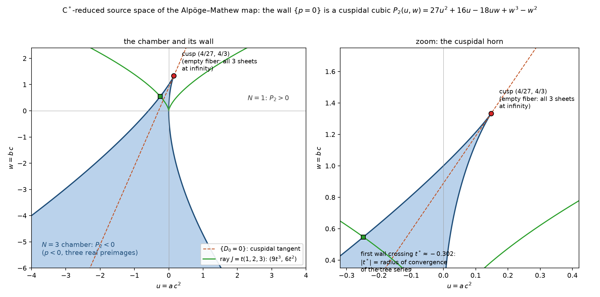

# The Chamber Geometry of the Counterexample, and Whether It Is a Positive Geometry

*(2026-07-21. All claims verified in `scripts/positive_geometry.py` (exact,
symbolic; runs in ~2 s); figure from `scripts/plot_chamber.py`. This answers
the open question posed in `docs/AMPLITUDES_CONNECTION.md` §2.4, using the
polypol/adjoint framework of Kohn–Piene–Ranestad–Rydell–Shapiro–Sinn–Sorea–
Telen [KPR+25] that underpins the positive-geometry program [ABL17, RST25,
BD25].)*

**Summary of the three main results.**

1. The C\*-symmetry of the counterexample reduces its entire chamber
   geometry to the plane, and there the non-properness wall $\{p=0\}$
   becomes a **cuspidal cubic** — a rational curve with a single $A_2$
   singularity. Its cuspidal tangent is exactly the "harmless" discriminant
   component $\{D_0 = 0\}$.
2. The cusp is precisely the **non-surjectivity locus** of $F$: the image
   $F(\mathbb{C}^3)$ misses exactly one C\*-orbit, over which *all three*
   sheets sit at infinity — sources for which the classical field equations
   have **no solution at all**.
3. The $N=3$ chamber is **not a positive geometry** — and not by genus
   obstruction (the wall is rational!), but by a sharper mechanism: the two
   boundary vertices that a positive geometry needs have *collided* into
   the cusp, degenerating the would-be interval canonical form into a
   double pole with zero residue. The negative outcome anticipated as one
   branch of the falsifiability criteria in `docs/AMPLITUDES_CONNECTION.md`
   §2.5 is the one realized, in exactly the predicted form (non-logarithmic
   singularity on the wall).

---

## 1. The C\*-reduction: the wall is a plane cuspidal cubic

The counterexample is equivariant under the $\mathbb{C}^*$-action with
source weights $(a,b,c) \mapsto (\lambda^{-2}a, \lambda^{-1}b, \lambda c)$
(see `docs/NEW_COUNTEREXAMPLES.md`). The wall polynomial is
quasi-homogeneous of weight $-2$ — every one of its five monomials has the
same weight (verified). Hence in the weight-zero invariants

$$
u = a c^2, \qquad w = b c,
$$

the wall descends to a *plane curve*:

$$
c^2\, p \;=\; P_2(u,w) \;=\; 27u^2 + 16u - 18uw + w^3 - w^2 ,
$$

and on the chart $c \neq 0$ the chamber rule reads
$\mathrm{sign} p = \mathrm{sign} P_2$: the entire
$N(J) \in \{1,3\}$ stratification of three-dimensional source space is the
pullback of the two plane regions $\{P_2 < 0\}$ and $\{P_2 > 0\}$. The
five-monomial quartic wall in $\mathbb{C}^3$ was hiding a **cubic plane
curve**.

Exact facts about this cubic (all symbolically verified):

- **Unique singular point** at $(u,w) = (4/27,\, 4/3)$, an **ordinary cusp**
  ($A_2$): the quadratic part of $P_2$ there is the perfect square
  $3(3\,\delta u - \delta w)^2$, and the restriction to the tangent
  direction is exactly $27\,\delta u^3$ (contact order 3). A cubic with a
  cusp is rational (genus 0), projectively equivalent to $y^2 z = x^3$.
- **The cuspidal tangent is the $D_0$-line.** The x-collision locus
  $D_0 = 27ac^2 - 9bc + 8$ (weight 0 already) descends to the line
  $27u - 9w + 8 = 0$, which is precisely the tangent line at the cusp. The
  algebraic identity $4q^3 + 27pr^2 = 4D_0^2$ found during the monodromy
  work is the shadow of this tangency: *the two discriminant components of
  the eliminant cubic are a curve and its cuspidal tangent.*
- **Exact rational parametrization** (lines of slope $m$ through the cusp):

$$
u(m) = \frac{4}{27} - \frac{3(m-3)^2}{m^3}, \qquad
w(m) = \frac{4}{3} - \frac{3(m-3)^2}{m^2},
$$

  with $m = 3 \mapsto$ cusp and $m = 0 \mapsto$ the unique point at
  infinity $[1:0:0]$, where the line at infinity has contact order 3 (a
  flex at infinity).
- **Real picture** ($P_2$ is quadratic in $u$, discriminant
  $-4(3w-4)^3$): the $N=3$ chamber is a single connected "horn"
  $u_-(w) < u < u_+(w)$, $w < 4/3$, pinched at the cusp at its top — see
  the figure. The tree-expansion ray $J = t(1,2,3)$ maps to the curve
  $(9t^3, 6t^2)$, whose first wall crossing $|t^*| = 0.302$ is the verified
  radius of convergence.

## 2. The cusp is the non-surjectivity locus: sources with *no* classical solution

At a generic wall point ($p=0$, $q\neq 0$) the eliminant $pX^3+qX+r$ loses
two roots to infinity (the escaping pair $X \sim \pm\sqrt{-q/p}$) and keeps
one finite preimage $X = -r/q$. At the cusp something stronger happens:
$q = 4 - 3bc = 4 - 3w$ vanishes there too ($w = 4/3$), and the eliminant
degenerates to the unsolvable $r = -2c = 0$ ($c \neq 0$ on the chart). The
system $\{p = 0\} \cap \{q = 0\}$ in the invariants is *exactly* the cusp
(verified), and the converse direction is covered by the on-wall identity
$D_0^2 = q^3$ plus a direct preimage formula $(0,\,b,\,a-4b^2)$ for targets
with $c = 0$. Hence, exactly:

$$
\mathbb{C}^3 \setminus F(\mathbb{C}^3)
\;=\; \bigl\{\, a c^2 = \tfrac{4}{27},\ b c = \tfrac{4}{3} \,\bigr\}
\quad\text{— one C\*-orbit, a smooth rational curve.}
$$

The fiber over these targets is empty: **all three sheets are at
infinity.** In the QFT reading these are external sources for which the
classical equations of motion have no solution whatsoever — not a
degenerate vacuum, not a merged pair of vacua, but a theory whose entire
solution set has escaped through the boundary of field space. The wall is
thus stratified by escape count: $2$ sheets escape at generic wall points,
$3$ at the cusp orbit. The counterexample is non-injective *and*
non-surjective, and both defects are now located exactly.

## 3. Verdict: the chamber is not a positive geometry — and why

The open question from `docs/AMPLITUDES_CONNECTION.md` §2.4(1) is now
decidable because the C\*-reduction turns it into a plane polypol problem,
where the complete theory of [KPR+25] applies: for a boundary curve of
degree $d$ the canonical form is $\Omega = A\,du\wedge dw / P_2$ with $A$
an *adjoint* of degree $d - 3$; for our cubic, $A$ is a constant — or, if
the line at infinity is admitted as a boundary component (the chamber is
unbounded and its projective closure touches infinity exactly at the flex
$[1:0:0]$), an affine-linear adjoint.

The residue of $\Omega$ along the wall, computed exactly on the
normalization $\mathbb{P}^1_m$:

$$
\mathrm{Res}_{P_2=0}\, \frac{\kappa\, du\wedge dw}{P_2}
\;=\; -\frac{\kappa}{3}\,\frac{dm}{(m-3)^2}.
$$

This is a **double pole at the cusp parameter with zero residue** — not a
logarithmic form. The 1D positive-geometry axiom requires simple poles at
the boundary vertices with residues $\pm 1$; a residueless double pole is
the canonical form of *no* positive (or pseudo-positive) geometry.
Admitting the linear adjoint does not help: imposing simple poles located
only at the two candidate vertices ($m=3$ cusp, $m=0$ flex at infinity)
forces the numerator to vanish identically (a $3\times 3$ linear system
with only the zero solution, computed exactly). **No nonzero canonical
form exists.**

The mechanism is more instructive than the verdict:

- It is *not* the genus obstruction. The wall is rational — precisely the
  case where plane chambers usually *are* positive geometries. A chamber
  bounded by a **nodal** cubic has residue
  $dm\,\bigl(\tfrac{1}{m-m_1} - \tfrac{1}{m-m_2}\bigr)$ — the canonical
  form of the interval between the node's two preimages $m_1 \neq m_2$ on
  the normalization; those chambers pass the axioms.
- Here the two would-be vertices have **collided**: node $\to$ cusp,
  $m_1 = m_2 = 3$, and the interval form degenerates exactly into the
  residueless double pole above. The chamber sits *on the boundary of the
  positive-geometry class*, failing by a single vertex collision.
- The collision is not an accident of coordinates — it is the geometric
  face of the QFT statement of §2: the cusp is the total-escape point. In
  slogan form: **the chamber of a Keller counterexample fails to be a
  positive geometry exactly at the source where the classical theory loses
  all its solutions to infinity.**

What this does and does not license (claims-ledger discipline):

- It settles question (1) of `docs/AMPLITUDES_CONNECTION.md` §2.4
  *negatively for this counterexample*, in the C\*-reduced plane where the
  question is well-posed and the [KPR+25] theory is complete. The
  three-dimensional chamber is the C\*-cone over the plane one; we make no
  claim about non-equivariant positive-geometry structures on the cone
  itself.
- It does *not* say positive geometry is irrelevant here — the failure
  mode (vertex collision at a cusp) is itself a structured, recognizable
  degeneration, of the kind catalogued in the polypol literature
  [KPR+25, §"pseudo-positive"]. If new counterexamples exist with nodal
  walls (our rigidity analysis constrains but does not exclude other
  weight systems), *their* chambers would be genuine positive geometries;
  "which Keller maps have positive-geometry chambers" is now a precise
  classification question, and cuspidal degenerations mark the boundary.
- It does not bear on the amplituhedron itself (a statement about planar
  $\mathcal{N}=4$ SYM integrands), only on the transfer of its geometric
  toolkit to field-space walls — which worked, end to end: the toolkit
  *decided* the question.

## 4. Holomorphic vs real pushforward: the measure anomaly located exactly

A complementary exact dichotomy, now stated sharply (script §8). Because
$\det DF \equiv -2$:

$$
F_*\bigl(d^3\phi\bigr)
= \Bigl(\sum_{\text{sheets}} \tfrac{1}{\det DF}\Bigr) d^3J
= -\tfrac{3}{2}\, d^3J
\qquad\text{(holomorphic pushforward: \emph{constant})},
$$

with no pole and no jump — the canonical holomorphic volume form does not
see the wall at all (the CHY-type "sum over all solutions restores
rationality" mechanism in its most extreme form). The *real* pushforward
of Lebesgue measure is instead $\tfrac{N(J)}{2}\, d^3J$, which jumps
between $\tfrac12$ and $\tfrac32$ across the wall. The measured anomaly
factor $A(\sigma) \to 2$ of `scripts/measure_anomaly.py` is exactly the
gap between the two pushforwards, sampled by a Gaussian ensemble centered
on the wall. This is the cleanest formulation we have of the
field-redefinition defect: *real integration counts sheets, holomorphic
residue calculus counts them with orientation — and only the difference is
sensitive to non-properness.*

## 5. New open questions

1. **Which Keller chambers are positive geometries?** For any counterexample
   map, the wall-chamber pair is now a well-defined invariant; nodal walls
   give positive geometries, cuspidal ones do not. Is the cusp *forced* by
   the Keller condition in this weight system (tying rigidity,
   `docs/NEW_COUNTEREXAMPLES.md`, to the vertex collision), or is it an
   accident of the Alpöge–Mathew point?
2. **A canonical form for the wall complement instead.** While the chamber
   fails, the *complement of the wall* $\mathbb{C}^2 \setminus \{P_2=0\}$
   and the cusp-orbit complement in the image of $F$ are natural homes for
   log forms ($dP_2/P_2$ is perfectly good); the monodromy representation
   ($S_3$, `docs/MONODROMY.md`) acts on precisely this local system. The
   right amplituhedron-analogue object may be this pair (complement +
   local system), not the real chamber.
   *(Resolved 2026-07-21, and the answer is stronger than hoped: the wall
   pair is affinely isomorphic to the $A_2$-discriminant pair, the
   complement is a $K(B_3,1)$, and the sheet monodromy is the canonical
   $B_3 \to S_3$. See `docs/WALL_COMPLEMENT.md` and
   `scripts/wall_braid.py`.)*
3. **Cusp as an operator statement.** The empty-fiber orbit means the
   "interacting field" $\phi(J)$ has no branch — not even a multivalued one
   — over one curve of sources. What does this do to the trace observables?
   *(Resolved 2026-07-21, `scripts/cusp_traces.py`; see §6 below. Note the
   parenthetical originally attached to this question — that $e_2 = q/p$,
   $e_3 = -r/p$ stay finite at the cusp — was **wrong**: they diverge, as
   everywhere on the wall. The correct exact statements are in §7.)*

## 6. Addendum (2026-07-21): trace asymptotics at the wall and the cusp — resolved

*(All exact; `scripts/cusp_traces.py`, ~2 s. This resolves §5 Q3 and
corrects its original parenthetical.)*

The Newton power sums of the $x$-sheets are polynomial in $q/p$, $-r/p$:

$$
S_1 = 0,\quad
S_2 = -\frac{2q}{p},\quad
S_3 = -\frac{3r}{p},\quad
S_4 = \frac{2q^2}{p^2},\quad
S_5 = \frac{5qr}{p^2},\quad
S_6 = -\frac{2q^3}{p^3} + \frac{3r^2}{p^2},\ \ldots
$$

so **all traces except $S_1 \equiv 0$ diverge on the wall, cusp included**
— the original suggestion that $e_2, e_3$ stay finite there was wrong. The
sharp structure is in the *rates*, stratum by stratum:

1. **Generic wall point** ($p \to 0$, $q \neq 0$): the escaping pair
   $x \sim \pm\sqrt{-q/p}$ gives pole order $\lfloor k/2 \rfloor$ for
   $S_k$ — odd powers cancel between the pair at leading order (verified
   symbolically for $k \le 8$).
2. **Cusp, generic approach** ($p \sim \varepsilon^2$,
   $q \sim \varepsilon$, $r = O(1)$): all three sheets escape as
   *asymptotic cube roots of unity*,
   $x_j \sim \omega^j(-r/p)^{1/3}$. Since
   $1 + \omega + \omega^2 = 0$, the naive rate $\varepsilon^{-2k/3}$ of
   $S_k$ is reduced **exactly when $3 \nmid k$** (the
   "$\omega$-cancellation"); the exact rate is
   $\max\{a + 2b : 2a + 3b = k\}$ in $\varepsilon^{-1}$, verified for
   $k \le 9$. *The trace remembers that the escaping configuration is a
   $\mathbb{Z}_3$-symmetric triple even though no fiber point exists over
   the cusp itself.*
3. **Cusp, tangent approach** (along the $D_0$-line): the model is
   **exactly solvable for every $\varepsilon$**:
   $27\varepsilon^3X^3 - 9\varepsilon X - 2
   = (3\varepsilon X - 2)(3\varepsilon X + 1)^2$, so the fiber
   $x$-coordinates are exactly $\{2/(3\varepsilon),\,
   -1/(3\varepsilon)\ \text{(double)}\}$ — the $x$-collision structure of
   the $D_0$-locus persists all the way into the cusp, and there is no
   cube-root regime on the tangent (the $qX$ term balances $pX^3$). The
   fiber itself stays étale: the two $x$-degenerate points remain distinct
   in $(y,z)$ (verified exactly at $\varepsilon = 1/10$).

Physics reading: the wall carries a stratified escape structure —
square-root pair (generic), $\mathbb{Z}_3$-triple (cusp, generic
direction), collided pair (cusp, tangent direction) — and the trace
observables detect the stratum through their divergence *rates*, even
where they detect nothing through their *values* (all rational in $J$ with
poles only on $\{p=0\}$).

## 7. References

- [ABL17] N. Arkani-Hamed, Y. Bai, T. Lam, *Positive geometries and
  canonical forms*, JHEP **11** (2017) 039. arXiv:1703.04541.
- [KPR+25] K. Kohn, R. Piene, K. Ranestad, F. Rydell, B. Shapiro, R. Sinn,
  M.-Ş. Sorea, S. Telen, *Adjoints and canonical forms of polypols*,
  Doc. Math. **30** (2025) 275–346. arXiv:2108.11747.
- [BD25] F. Brown, C. Dupont, *Positive geometries and canonical forms via
  mixed Hodge theory*, Comm. Math. Phys. **406** (2025) 267.
  arXiv:2501.03202. (Genus-zero pairs as the natural framework — note that
  our wall *is* genus zero and the failure is a vertex degeneration, not a
  genus obstruction.)
- [RST25] K. Ranestad, B. Sturmfels, S. Telen, *What is positive
  geometry?*, Le Matematiche (2025). arXiv:2502.12815.
- [Lam24] T. Lam, *An invitation to positive geometries*, Proc. Sympos.
  Pure Math. **110** (2024) 159–179. arXiv:2208.05407.
- [ELT25] C. Even-Zohar, T. Lakrec, R. J. Tessler, *The amplituhedron BCFW
  triangulation*, Invent. Math. (2025). (The BCFW triangulation conjecture
  for $\mathcal{A}_{n,k,4}$ is now a theorem — the "diagrams triangulate a
  geometry" paradigm at full strength.)
